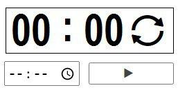

# Создаем секундомер

Создаем секундомер

## Задание:

> Задание на пятницу 07-08-2020: 1) Доделать/переделать и сдать верстку с фигмы. 2) Сверстать блок, подобному нарисованному ниже: Поле таймера, под полем таймера поле для ввода времени и справа кнопка запуска. Треугольник на кнопке запуска взять с fontello. При нажатии на кнопку должны появляться две круговые стрелочки в поле таймера, справа от нулей, их тоже взять с fontello (spin3). 3) Стрелочки spin3, которые появляются при нажатии на кнопку, должны вращаться

## Ссылка на страничку:

[Секундомер](https://xronik.github.io/PROCODE/07.08.20/index.html)