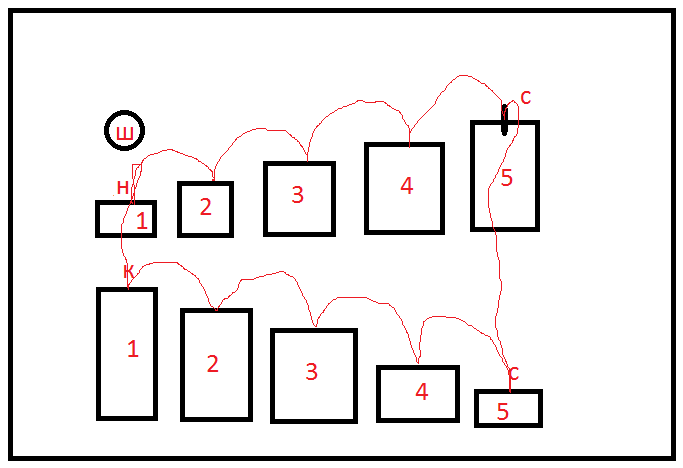

# Создаем анимацию

Создаем анимацию прямоугольникови шарика

## Задание:

> Домашнее задание на вторник 11-08-2020: 1) создать анимацию, при которой шар будет прыгать по ступенкам. Схема ниже, н- начало анимации, с- середина, к- конец анимации. Анимация должна быть циклической. 2) Доп. задание: шар прыгает со ступеньки на ступеньку по плавной траектории. 3) Доп. задание: капля воды капает из крана. Падает на поверхность и на поверхности расходятся круги. Бесконечная анимация.

## Ссылка на страничку:

[Анимация](https://xronik.github.io/PROCODE/08.08.20/index.html)