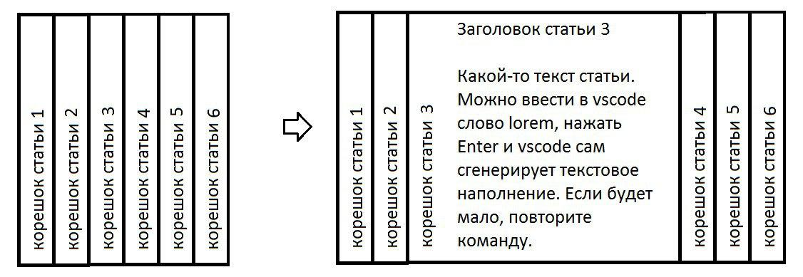

# Создаем кнопку с бликом и развертывание статей

Создаем кнопку которая при наведение отдает бликом а также ряд корешков книги которые при наведении развертываются

## Задание:

> Домашнее задание на пятницу 14-08-2020: 1) Создать кнопку с текстом "Animated". Кнопка должна иметь объемную форму. При наведении мышки на кнопку, по всей поверхности пролетал блик (светлая косая линия) в одну сторону, слева направо. При убирании курсора мышки блик должен пролетать справа налево. При нажатии на кнопку мышкой, кнопка должна утапливаться. 2) Дополнительное задание: На странице, как книги, стоят в ряд корешки статей. При наведении на такой корешок, статья должна раскрываться вправо, справа стоящие статьи должны сдвигаться, освобождая место для статьи. Для наглядности прикладываю изображение ниже. Оба задания выполнить на одной странице.

## Ссылка на страничку:

[Анимация журнала и кнопки с бликом](https://xronik.github.io/PROCODE/14.08.20/index.html)