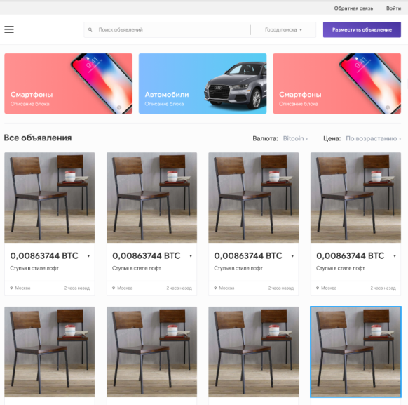

# Создаем страничку

Создаем страничку с адаптивной версткой

## Задание:

> Задание: сверстать адаптивный макет. Верстаем то, что нарисовано на картинках media-min.png и media-max.png . Ссылка на фигму только для того, чтобы вы могли взять оттуда размеры и другие свойства элементов. (2й макет) Правила следующие: 1)    если ширина браузера меньше, чем ширина СМАРТФОНЫ, должна появляться горизонтальная полоса прокрутки. 2)    если ширина браузера больше  чем ширина элемента СМАРТФОНЫ и меньше 750пикс, то блоки СМАРТФОНЫ и СТУЛЬЯ выстраиваются в колонки, при этом между ними и с краёв увеличивается или уменшается свободное пространство. 3)    если ширина больше 750пикс и меньше чем 4 колонки элементов СТУЛЬЯ то нужно сделать появление полей поиска и города, а также иконки ВАЛЮТА и СОРТИРОВКА заменить на слова 4)    если ширина больше чем 4 колонки элементов СТУЛЬЯ, то появляются «уши» - это значит что ширина контента остаётся неизменной, а слева и справа появляется пустое пространство. Верстать по принципу MOBILE FIRST.  Обязательно выгрузить на github.io и предоставить ссылку. Размеры элементов не меняются при любой ширине браузера.

## Ссылка на страничку:

[Адаптив](https://xronik.github.io/PROCODE/17.08.20/index.html)