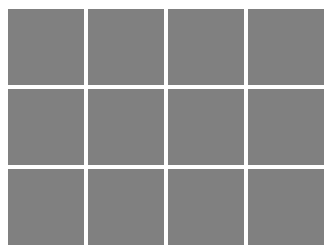

# Создаем програмируемые кубики

Создаем кубики с использованием возможностей SCSS

## Задание:

> Задание: Задание  на пятницу 21-08-2020: 1) Средствами SASS сверстать 12 квадратов с одинаковыми отступами между ними. 2) Дополнительное задание: размер стороны квадрата задавать через переменную. 3) Дополнительное задание: отобразить любое количество квадратов, при этом в SCSS задавая три переменные: размер стороны квадрата, число строк, число колонок (без каких-либо ограничений). 

## Ссылка на страничку:

[Програмируемые кубы](https://xronik.github.io/PROCODE/18.08.20/index.html)