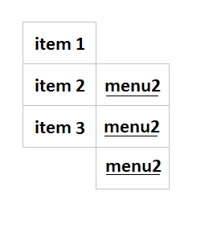

# Создаем выпадающее меню

Создаем выпадающее меню

## Задание:

> Задание на субботу 18-07-2020: сделать выпадающее меню, такое как на картинке. Если наводить мышкой на блок item1- выпадает меню из трех пунктов menu1 menu1 menu1. В любом блоке этого меню кликабельная пустая ссылка. Если курсор убрать с item1 или menu1, то выпадающее меню пропадает. Аналогично item2 и item3. Выложить на github.io, мне в телеграм ссылку.

## Ссылка на страничку:

[Выпадающее меню](https://xronik.github.io/PROCODE/19.07.20/index.html)