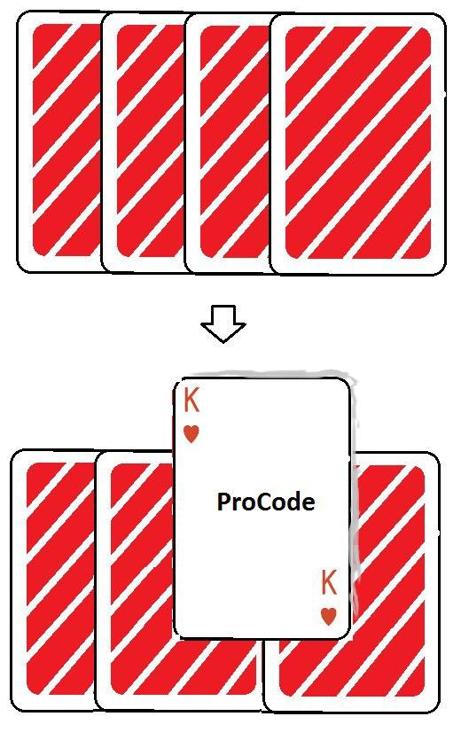

# Создаем анимацию для нескольких карт

Создаем анимацию для нескольких карт

## Задание:

> Задание на вторник 21-07-2020: Уровень-1 обязательный) На столе в ряд лежат в ряд, но друг на друге, 10 карт. Смещение между ними вправо на 40% ширины карты. Лежат рубашками кверху. Рубашки карт имеют фон косых белых полосок на красном фоне, толщина полосок 25%, угол 30градусов. Карты имеют скругление по углам, между краем карт и рубашкой отступ 5% от высоты карты, по периметру, даже на скошенных уголках. Наведении курсора карту, карта приподнимается вверх на 30% от высоты карты, над столом(тень) и переворачивается. Если курсор убрать, карта возвращается на место. На лицевой стороне слева сверху и справа снизу написано какая карта. Посередине большим шрифтом слово "ProCode", цвет слова тёмно-серый. Все проценты высчитать в пикселях. Сотношение сторон карт 5 к 7. 
Уровень-2) На карте внизу справа номинал перевернуть на 180градусов, как на обычных картах. 
Уровень-3) Переворот карты анимировать.
В домашнем задании нельзя использовать картинки, исключительно html+css.

## Ссылка на страничку:

[Анимированые карты](https://xronik.github.io/PROCODE/19.07.20/index.html)