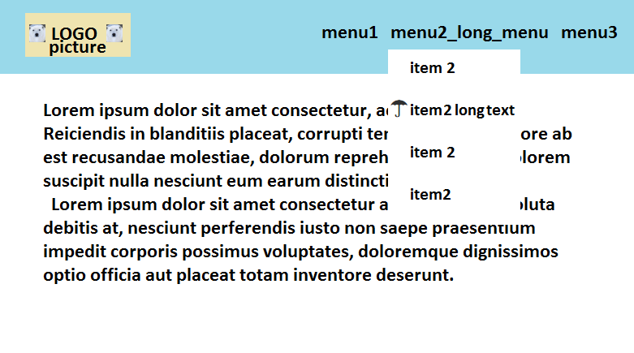

# Создаем резиновый хедер

Создаем в хедере отзывчивое меню с лого

## Задание:

> Домашнее задание на пятницу, 24-07-2020: 
Сделать страницу, сверху блок заголовка, снизу блок основной. В основном блоке пишем текст. В заголовке слева помещаем изображение-логотип, справа 3 блока выпадающего меню. Меню сделать таким образом, чтобы оно 1) при изменении ширины браузера оставалось с правой стороны, 2) чтобы при изменении ширины текста в любом пункте меню, оно автоматом подстраивалось 3) при наведении мышки на выпадающий любой пункт меню слева рисуется зонтик.

## Ссылка на страничку:

[Резиновый хедер с меню](https://xronik.github.io/PROCODE/22.07.20/index.html)