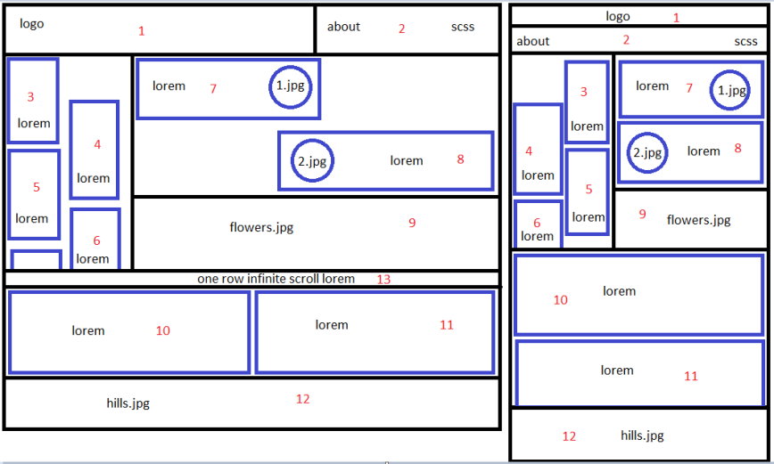

# Создаем grid-layout

Создаем верстку лендинга с помощью технологии grid

## Задание:

> Задание: Задание: свертать в grid layout макет. Десктопная и мобильная версия. Переключаются на 400пикс. Если ширина больше 1200пикс, то появляются уши. Верстать в 12-ти колонках.Примечания:lorem - любой текст, который заполняет блок about - пустая ссылка scss - правильная ссылка на ваш .scss файл 3-6 блоки скролятся 1.jpg, 2.jpg - круглые картинки 10,11 блоки можно флексами 12 блок виден всегда, на любом разрешении, картинка "горы" 13 блок - бесконечная прокрутка какого-то текста слева направо, анимация

## Ссылка на страничку:

[Адаптивная страница с помощью Grid Layout](https://xronik.github.io/PROCODE/22.08.20/index.html)