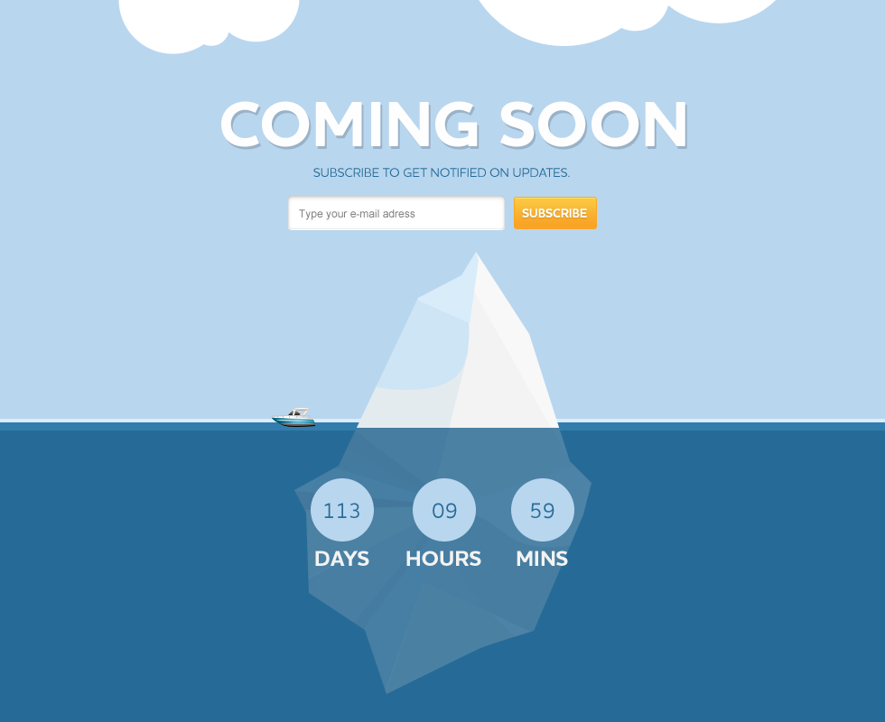

# Создаем простенький сайт с отчетом времени

Создаем сайт по макету в котором реализуем таймер до события через JS

## Задание:

> Задание на субботу 25-07-2020: Сверстать сайт Coming Soon. Файл coming_soon.zip в папке с видео. Шрифты подобрать из Google Fonts, не обязательно точно такие же, но похожие. Верстать с плагином браузера PerfectPixel by WellDoneCode (pixel perfect).  При уменьшении масштаба сайт должен уменьшаться, но оставаться по центру и сверху. В 16:00 предоставить мне в телеграм скриншот того, что вы успели сверстать и комментарии, что сделано, что не сделано. Если не пришлёте, буду считать, что вы задание не выполняли.

## Ссылка на страничку:

[Сайт с отсчётом времени](https://xronik.github.io/PROCODE/26.07.20/index.html)